# Exercise 01: Create and Deploy Your Azure SRE Agent
### Estimated Duration: 30 Minutes

## 📘 Scenario
You are the site reliability engineer for a small Azure-hosted web application that has started returning intermittent HTTP 500 responses. Before you can use Azure SRE Agent to investigate the incident, you need to confirm the lab workload and telemetry are present, create or open the Azure SRE Agent, connect it to Application Insights or Log Analytics where available, and grant it scoped read-oriented access to the workload resource group.

## 📖 Overview
In this exercise, you will sign in to the Azure portal and Azure SRE Agent portal, inspect the lab-created App Service workload, and then follow one of two onboarding paths. If the ARM deployment already created the Azure SRE Agent, you will open and verify it. If the preview ARM resource was not available in your tenant, you will create the agent manually at https://sre.azure.com. You will then add Azure resource access at resource-group scope in Reader mode and confirm the agent can describe the resources it can see.

## 🎯 Objectives
In this exercise, you will complete the following tasks:

- Task 1: Sign in and review the lab workload resources
- Task 2: Confirm Azure SRE Agent prerequisites and preview availability
- Task 3: Open the ARM-precreated agent or create an agent manually
- Task 4: Connect telemetry and add Azure resource access in Reader mode
- Task 5: Verify the agent can see the lab resources

## Task 1: Sign in and review the lab workload resources
In this task, you will sign in with your CloudLabs-provided Azure account and locate the web app, Application Insights, and Log Analytics resources that the lab deployment created.

1. In the Lab VM, click **Microsoft Edge**, and go to **Azure Portal.**
      
      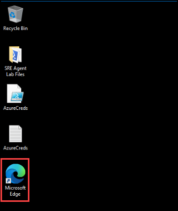

   ```
   https://portal.azure.com

   ```

2. Sign in with the following credentials:

   - Username: <inject key="AzureAdUserEmail"></inject>, click **Next**.

      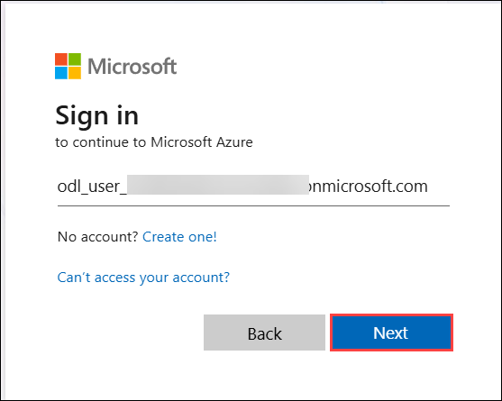

   - Password: <inject key="AzureAdUserPassword"></inject>, click **Sign in**.

      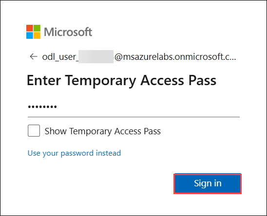
   
3. If prompted, complete any first-run Azure portal prompts by accepting defaults or selecting **Skip**.

4. In the Azure portal search bar, search for **Resource groups (1)**, and then select **Resource groups (2)**.

   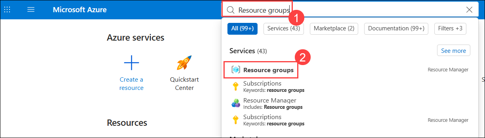

5. Open the Azure-SRE-<inject key="DeploymentID" enableCopy="false"/> resource group.

   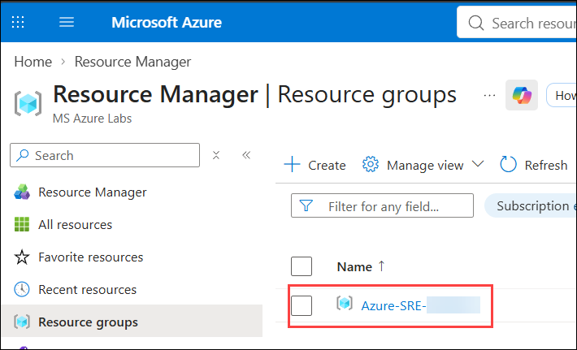

6. Confirm the resource group contains the following lab resources:

   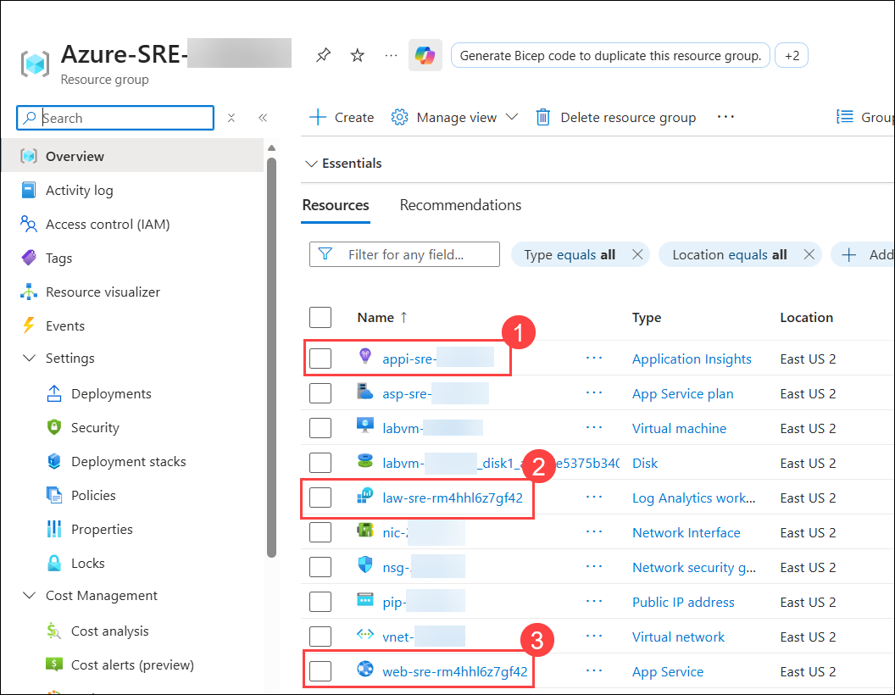

   | Resource | Expected value |
   | --- | --- |
   | App Service web app **(3)** | <inject key="webAppName"></inject> |
   | Application Insights **(1)** | <inject key="appInsightsName"></inject> |
   | Log Analytics workspace **(2)** | <inject key="logAnalyticsWorkspaceName"></inject> |

7. Open the App Service web app named <inject key="webAppName"></inject>.

   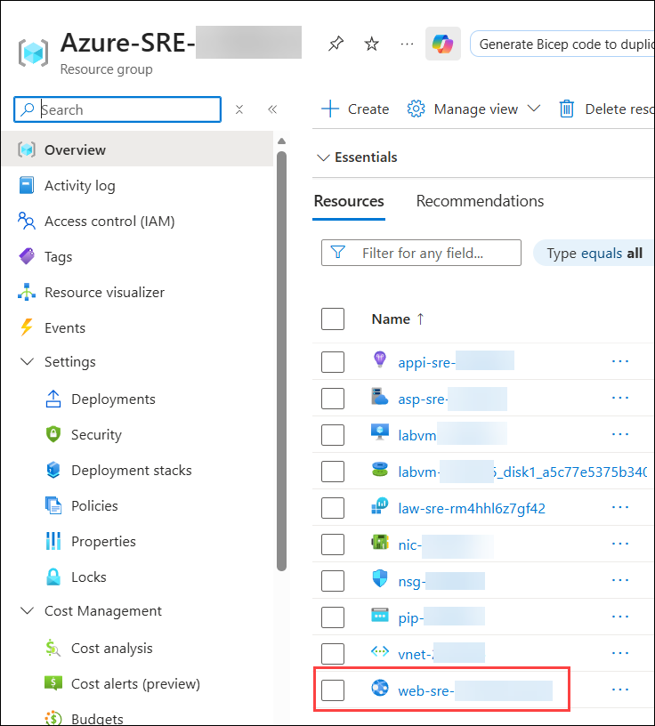

8. On the App Service **Overview** page, select the **web app** URL to open the sample site in a new browser tab.

   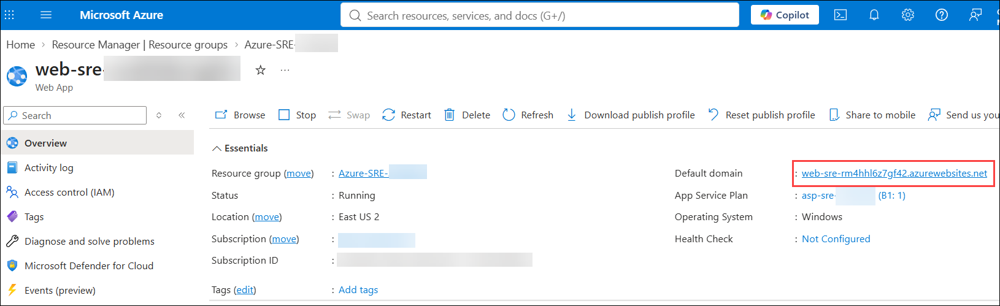

   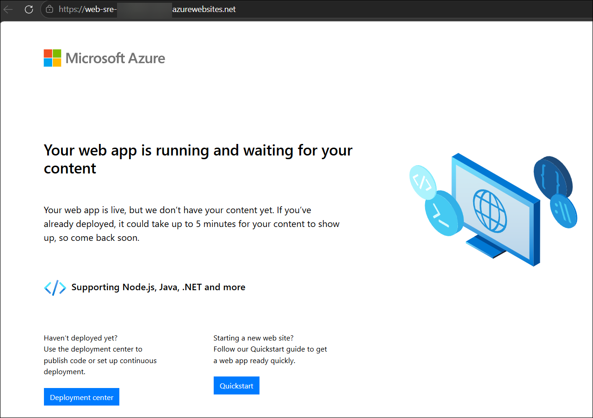

9. Return to the App Service page, and then select **Monitoring (1)** > **Application Insights (2)**. Confirm the web app is connected to Application Insights. If the portal shows a link to the Application Insights resource, open it and verify its name is **<inject key="appInsightsName"></inject> (3)**.

   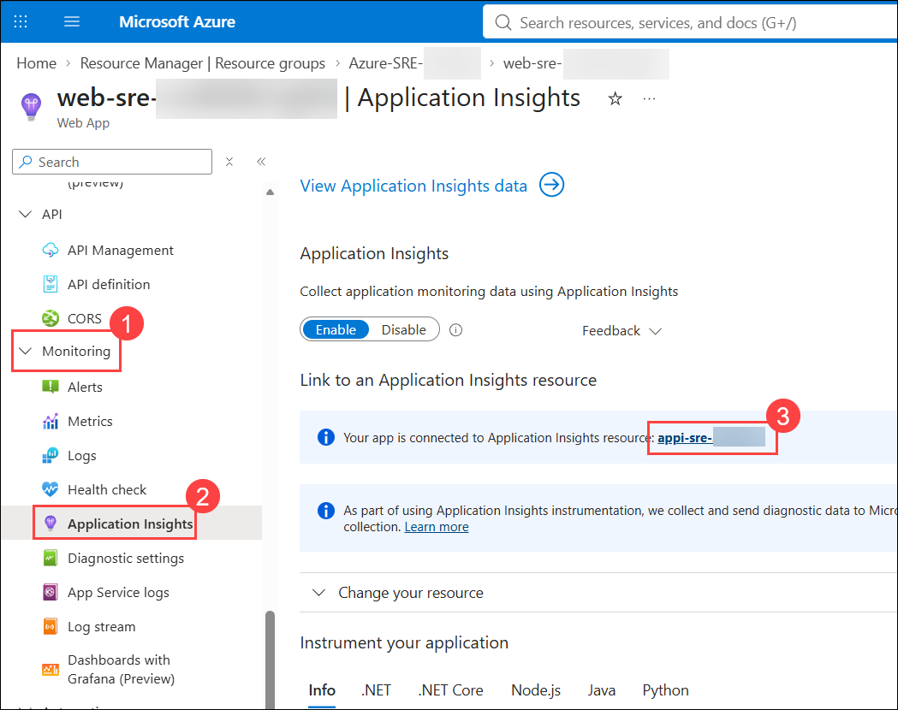

10. Go back to the lab resource group, open the Log Analytics workspace named **<inject key="logAnalyticsWorkspaceName"></inject>**, and confirm the **Overview** page loads.

    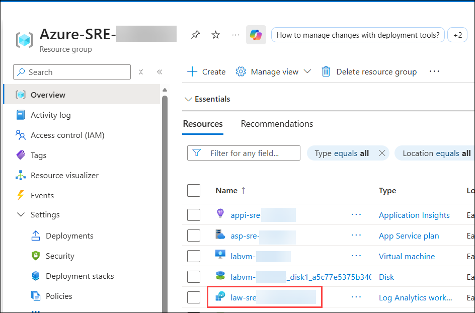

    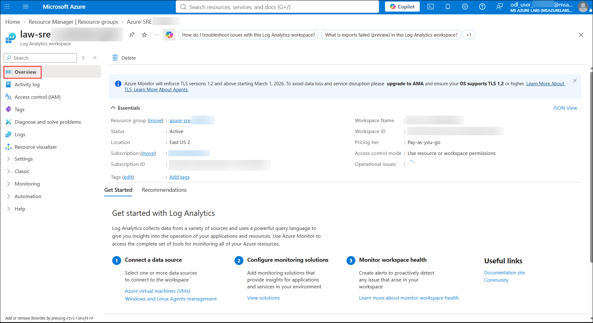

    >**Note**:Keep the browser tabs for the lab resource group, the web app, Application Insights, and Log Analytics open. You will use these names when you verify the SRE Agent response later in the exercise.

Congratulations on completing the task! Now, it's time to validate it. Here are the steps:

- Hit the **Validate** button for the corresponding task. If you receive a success message, you can proceed to the next task.
- If not, carefully read the error message and retry the step, following the instructions in the exercise guide.
- If you need any assistance, don't hesitate to get in touch with us at cloudlabs-support@spektrasystems.com. We are available 24/7 to assist you.

<validation step="Validate workload and telemetry readiness"/>

## Task 2: Confirm Azure SRE Agent prerequisites and preview availability
In this task, you will confirm that the account and subscription can access the Azure SRE Agent preview resource type. Azure SRE Agent uses the ARM resource type **Microsoft.App/agents** and the preview API version **2025-05-01-preview**. The portal flow is the primary path for this lab because the preview schema and provider availability can vary by tenant.

1. In the Azure portal, select **Cloud Shell (1)** from the top toolbar, and click **PowerShell (2)**.
   
   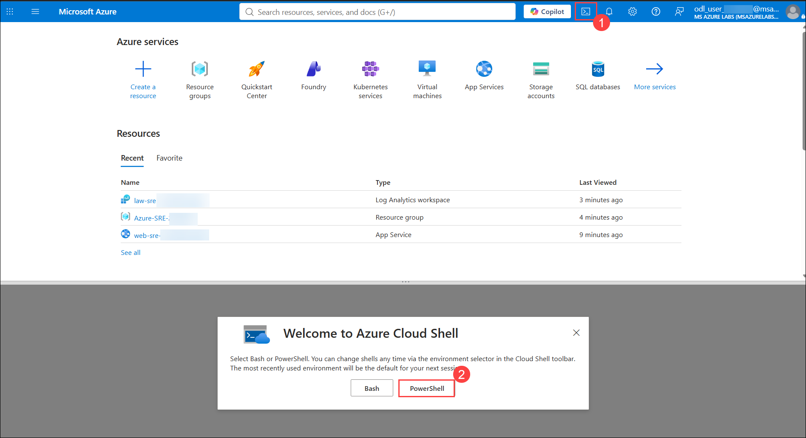

3. If Cloud Shell prompts you to create a storage account, select **No storage account required (1)**. Then open the **Subscription (2)** dropdown and select the available **Subscription (3)** option to proceed.

   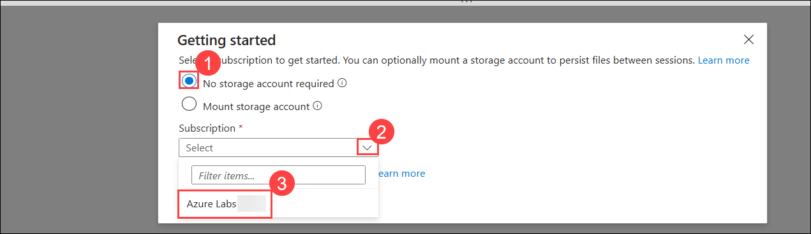

1. Click **Apply**, and the **PowerShell** terminal will be launched.

   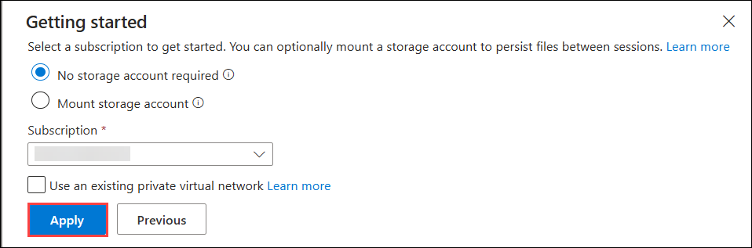

4. Confirm that Cloud Shell is using the lab subscription by running the following command:

   ```powershell
   az account show --query "{name:name,id:id,tenantId:tenantId}" -o table
   ```

   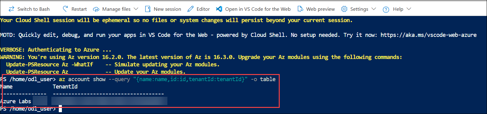

5. Confirm that the subscription ID shown by the command matches <inject key="SubscriptionID"></inject>.

6. If the subscription shown is different, run the following command. Replace **LAB_SUBSCRIPTION_ID** with <inject key="SubscriptionID"></inject> before you run it.

   ```powershell
   az account set --subscription "LAB_SUBSCRIPTION_ID"
   ```

   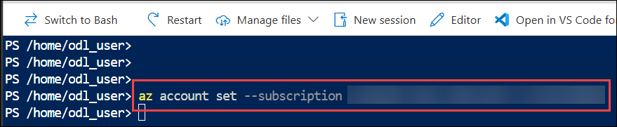

7. Check whether the **Microsoft.App** provider exposes the **agents** resource type in this tenant:

   ```powershell
   az provider show --namespace Microsoft.App --query "resourceTypes[?resourceType=='agents'].{resourceType:resourceType,apiVersions:apiVersions,locations:locations}" -o json
   ```

   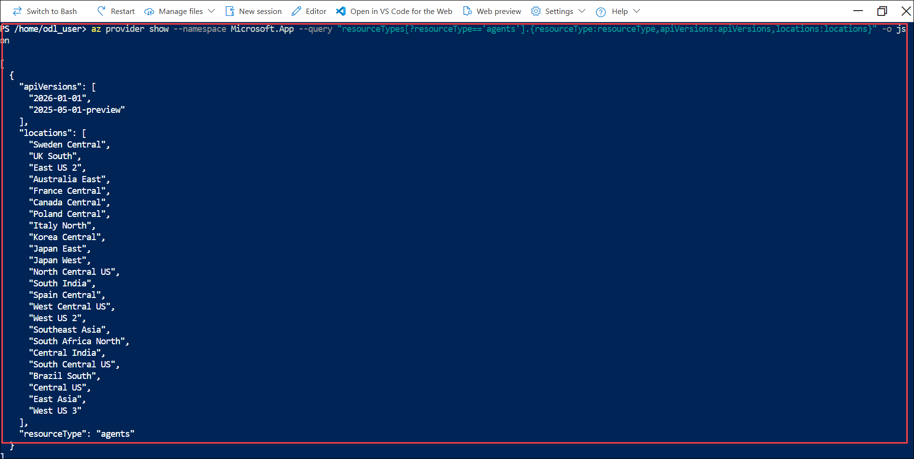

8. Review the output:

   - If you see **agents** and **2025-05-01-preview**, continue with the exercise.
   - If the output is empty or does not include **agents**, continue with the portal fallback in Task 3. The ARM deployment can still provide the web app, telemetry, and runbook for the lab.

## Task 3: Open the ARM-precreated agent or create an agent manually
In this task, you will open the Azure SRE Agent portal and either verify the existing agent or create a new one. The agent creation wizard may show model provider options that vary by subscription and region. Select the default available provider unless your instructor gives a different value.

1. Open a new browser tab and go to 

   ```
   https://sre.azure.com
   ```
1. After the tab is launched, click **Sign in**.

   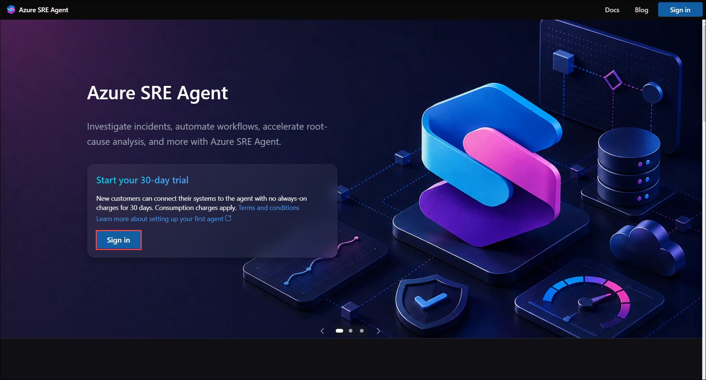

2. Sign in with the same Azure account you used for the Azure portal:

   - Username: <inject key="AzureAdUserEmail"></inject>

      

   - Password: <inject key="AzureAdUserPassword"></inject>

      

5. Once logged in, select **Create agent**.

   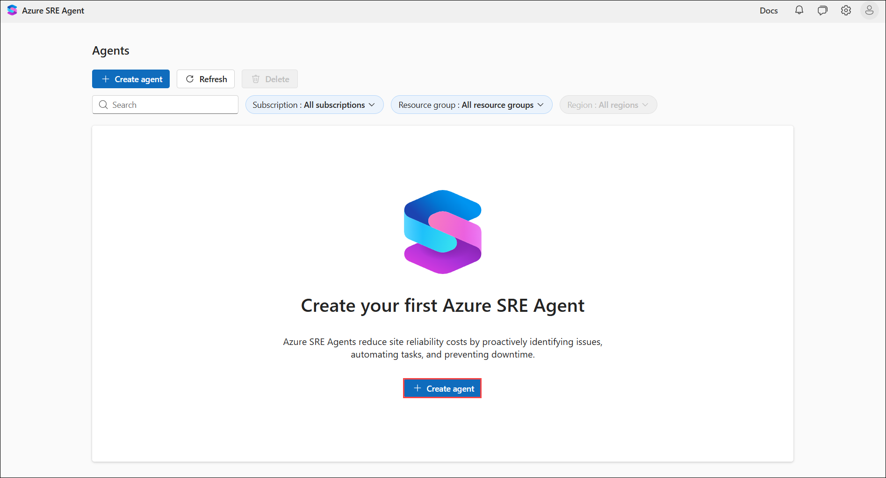

6. On the **Create agent** page, enter or select the following values:

   | Field | Value |
   | --- | --- |
   | Subscription | Select the available subscription **(1)** |
   | Resource group | **<inject key="workloadResourceGroupName"></inject> (2)** |
   | Agent name | Use **sreagent-<inject key="DeploymentID" enableCopy="false"/> (3)** |
   | Region | **East US 2 (4)**. If unavailable, choose **Sweden Central** or **Australia East**. |
   | Model provider | Select the default **(5)** available provider for the selected region. |
   | Application Insights | Select the existing **(6)** Application Insights resource <inject key="appInsightsName"></inject> **(7) & (8)**, and click **Next (9)**.  |

   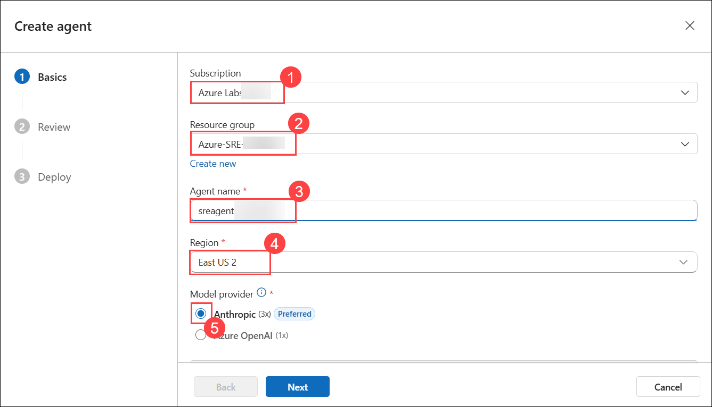

   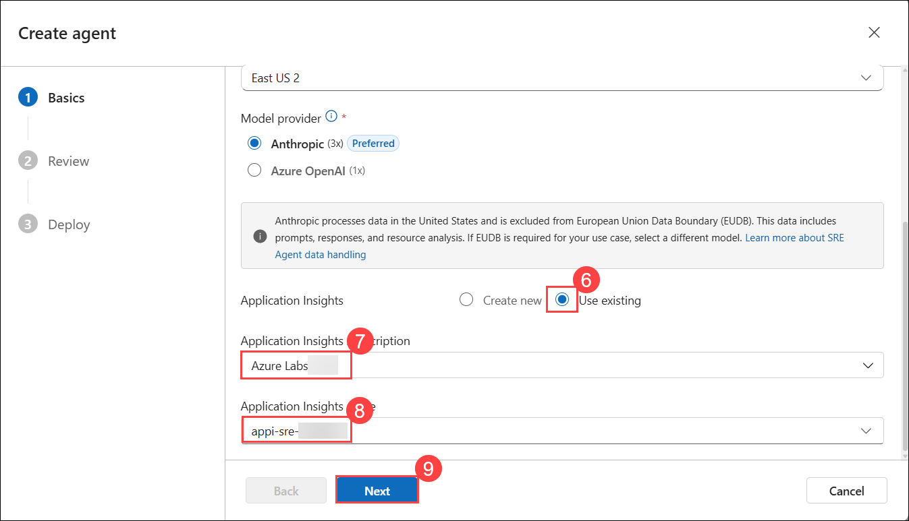

8. On the **Review** page, confirm the subscription, resource group, agent name, and region are correct. Click **Create**.

    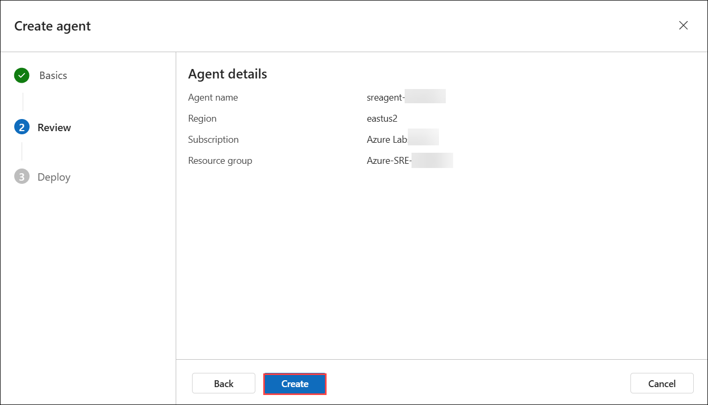

10. Wait for deployment to complete. Microsoft Learn notes that deployment commonly takes a few minutes. The deployment should show **Succeeded** and list the Azure SRE Agent resource and supporting resources that were created.

11. Select **Set up your agent** when the deployment completes. The setup page should show the header **More context. Better investigations** and cards such as **Code**, **Logs**, **Azure resources**, and **Incidents**, click **Done and go to agent**.

    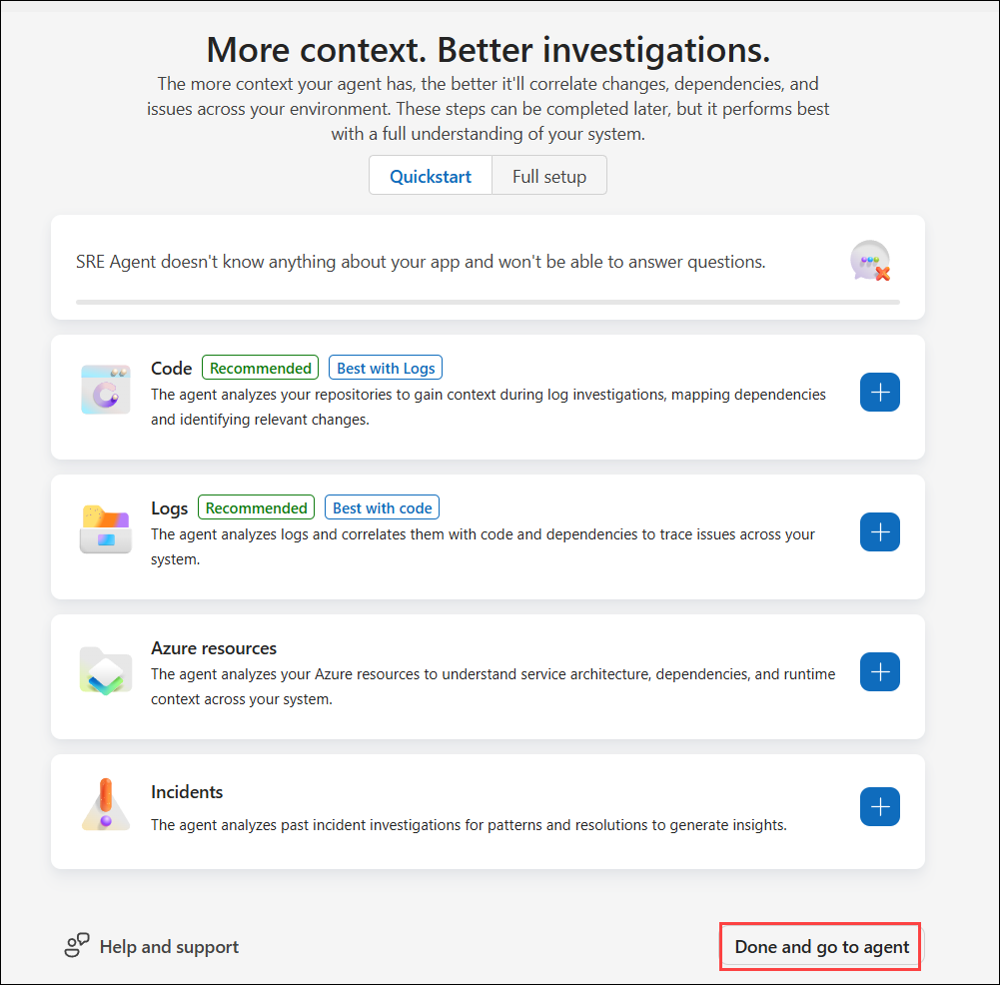


## Task 4: Connect telemetry and add Azure resource access in Reader mode
In this task, you will connect available telemetry and grant the agent scoped Azure resource access. For safety and least privilege, use the lab workload resource group scope and select **Reader** permission level when the portal offers a choice.

1. In the Azure SRE Agent setup page, locate the **Logs** card.

2. Select the **+** button on the **Logs** card.

3. In **Configure logging provider**, select one of the following providers based on what the portal offers:

   - **Application Insights**, for application requests, failures, dependencies, and performance telemetry.
   - **Log Analytics Workspace**, for logs, activity logs, and metrics in the workspace.

4. Select **Next**.

5. Select the lab telemetry resource:

   - Application Insights: <inject key="appInsightsName"></inject>
   - Log Analytics workspace: <inject key="logAnalyticsWorkspaceName"></inject>

6. Select **Next** to review the connector settings.

7. Select **Add connector**.

8. Wait until the **Logs** card shows a green checkmark or lists the connected telemetry source.

9. On the **Quickstart** tab, find the **Azure resources** card and select **Add resources**.

10. In **Choose resource type**, select **Resource group**, and then select **Next**.

11. In the **Subscription** filter, select the lab subscription <inject key="SubscriptionID"></inject> if it is not already selected.

12. Search for and select the resource group named <inject key="workloadResourceGroupName"></inject>.

13. Select **Next** to review agent permissions.

14. When the wizard asks for the permission level, select **Reader**.

15. Review the role assignments that will be granted to the agent managed identity. In Reader mode, the portal should grant read-oriented access such as **Reader**, **Monitoring Reader**, and **Log Analytics Reader**, plus any required resource-type reader or operator roles.

16. Select **Add resource group**.

17. Wait for role assignment to complete. This can take several minutes. When complete, the **Azure resources** card should list <inject key="workloadResourceGroupName"></inject>.

18. Select **Done and go to agent** to open the agent chat.

> [!Important]
> Do not select **Privileged** mode in this lab. The goal is to let the agent inspect configuration, health, metrics, and logs without granting broad remediation permissions.

## Task 5: Verify the agent can see the lab resources
In this task, you will use the Azure SRE Agent chat experience to verify that the agent can inspect the lab resource group and identify the workload resources.

1. In the Azure SRE Agent portal, open the chat for your agent.

2. If the agent asks you to select an agent or start a new thread, select the agent you created or verified in Task 3 and start a new chat.

3. Paste the following prompt into the chat box. Replace **LAB_WORKLOAD_RESOURCE_GROUP** with <inject key="workloadResourceGroupName"></inject> if you copied the prompt from this guide:

   ```text
   What Azure resources can you see in this lab resource group? Focus on the resource group named LAB_WORKLOAD_RESOURCE_GROUP. Include the App Service web app, Application Insights resource, and Log Analytics workspace if you can access them.
   ```

4. Review the response. A successful response should mention one or more of these lab resources:

   - The web app named <inject key="webAppName"></inject>
   - The Application Insights resource named <inject key="appInsightsName"></inject>
   - The Log Analytics workspace named <inject key="logAnalyticsWorkspaceName"></inject>
   - The lab workload resource group named <inject key="workloadResourceGroupName"></inject>

5. If the agent says it cannot access Azure resources, return to **Builder** or **Setup**, open the **Azure resources** card, and confirm that the resource group <inject key="workloadResourceGroupName"></inject> is connected in **Reader** mode.

6. If the agent can see the resource group but not telemetry, return to the **Logs** card and confirm that either Application Insights <inject key="appInsightsName"></inject> or Log Analytics workspace <inject key="logAnalyticsWorkspaceName"></inject> is connected.

7. Keep the chat thread open. You will use the same agent in Exercise 2 after you upload the team runbook.

Congratulations on completing the task! Now, it's time to validate it. Here are the steps:

- Hit the **Validate** button for the corresponding task. If you receive a success message, you can proceed to the next exercise.
- If not, carefully read the error message and retry the step, following the instructions in the exercise guide.
- If you need any assistance, don't hesitate to get in touch with us at cloudlabs-support@spektrasystems.com. We are available 24/7 to assist you.

<validation step="Validate SRE Agent deployment and Azure access setup"/>

## 🧾 Summary
In this exercise, you confirmed that the lab workload and telemetry resources are available, verified Microsoft.App/agents preview availability, opened or created an Azure SRE Agent in a supported region, connected telemetry where available, and granted the agent resource-group-scoped access in Reader mode. You also verified the setup by asking the agent what Azure resources it can see in the lab resource group.

You have successfully completed the exercise. Click **Next >>** to continue to Exercise 2.
