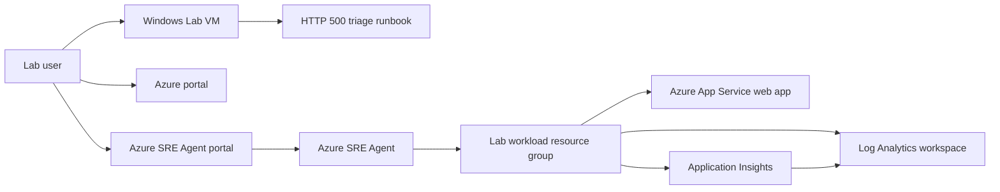

# Respond to Incidents with Azure SRE Agent
### Overall Estimated Duration: 60 Minutes

## 📘 Lab Scenario
You are acting as a site reliability engineer for a small Azure-hosted web application that has started returning intermittent HTTP 500 responses. In this lab, you will onboard Azure SRE Agent, grant it read-oriented access to a scoped lab workload, and add a team runbook so the agent can answer operational questions using your documented procedures instead of generic troubleshooting advice.

The lab is designed for a **60-minute** session. Spend the first few minutes reviewing the environment here, then complete Exercise 1 and Exercise 2.

## 📖 Lab Overview
In this lab, you will:

- Sign in to the Azure portal with your CloudLabs-provided account.
- Review a pre-created Azure App Service workload, Application Insights resource, and Log Analytics workspace.
- Open the Azure SRE Agent portal at <https://sre.azure.com>.
- Verify whether the Azure SRE Agent was created by the deployment, or create it manually in the portal if the preview ARM deployment path is unavailable in your tenant.
- Grant the agent scoped access to the lab workload resource group using the safest available read-only or review-oriented options.
- Upload the staged runbook [C:\LabFiles\Runbooks\appservice-http-500-triage.md](file:///C:/LabFiles/Runbooks/appservice-http-500-triage.md) to the agent knowledge base in Exercise 2.

## 🎯 Objectives
After completing this lab, you will be able to:

- Describe the Azure resources that make up the sample incident environment.
- Explain the preview status and supported-region requirements for Azure SRE Agent.
- Create or verify an Azure SRE Agent in the Azure SRE Agent portal.
- Configure the agent to inspect a workload resource group with least-privilege access.
- Add Markdown runbook knowledge to Azure SRE Agent and verify that responses cite or reference the uploaded guidance.

## ⚙️ Prerequisites
- Familiarity with the Azure portal and basic role-based access control (RBAC) concepts.
- Basic understanding of Application Insights, Log Analytics, and KQL.
- Familiarity with incident triage or on-call runbook concepts.
- An active Microsoft Azure subscription to provision and access required resources.
- A pre-provisioned Microsoft Entra ID user account with sufficient permissions to create and manage resources within the Azure subscription.

## 🏗️ Architecture
CloudLabs deploys a disposable lab environment that contains a Windows Lab VM, a small App Service workload, monitoring resources, and a staged operations runbook. The deployment also attempts to create an Azure SRE Agent resource when the preview API is available in the target tenant. If that preview resource cannot be deployed automatically, the exercises walk you through the documented portal fallback.

## 🖼️ Architecture Diagram

## 🔍 Explanation of Components
**Windows Lab VM**: Provides browser access, tools, helper files, and the staged runbook used throughout the lab.

**Azure App Service web app**: Represents the application that is returning intermittent HTTP 500 responses. It is the workload the SRE Agent investigates.

**Application Insights**: Collects application telemetry for requests, failures, dependencies, and diagnostics, and is one of the two supported telemetry connectors for Azure SRE Agent.

**Log Analytics workspace**: Stores queryable operational data used by Application Insights and Azure Monitor, and can be connected to the agent as a KQL-queryable log source.

**Runbook file**: Provides team-specific incident guidance for App Service HTTP 500 triage. The staged file is [C:\LabFiles\Runbooks\appservice-http-500-triage.md](file:///C:/LabFiles/Runbooks/appservice-http-500-triage.md). You upload this file to the agent's Knowledge base in Exercise 2 so that chat responses can be grounded in team-specific guidance.

**Azure SRE Agent**: Provides the agent experience for resource inspection, operational chat, and knowledge-grounded incident response. It may be pre-created by the deployment or created manually in Exercise 1.

## 🧪 Azure SRE Agent Preview Note
Azure SRE Agent is represented in Azure Resource Manager as the preview resource type **Microsoft.App/agents**. This lab plan targets API version **2025-05-01-preview** where ARM deployment is supported in the hosting tenant.

Because this resource type and API version are in preview, automated ARM creation can depend on tenant allow-listing, resource provider registration, model-provider availability, and region availability. The lab deployment is designed not to block the rest of the environment if the agent cannot be created automatically. If the deployment did not create the agent, Exercise 1 uses the documented Azure SRE Agent portal flow at <https://sre.azure.com>.

> [!Important]
> Use **Reader** or other read-only/review-style permission settings when the SRE Agent portal offers a choice. The lab focuses on investigation and recommendation workflows, not autonomous production changes.

## 🌍 Supported Regions
Azure SRE Agent is currently available in the following regions:

- **East US 2**
- **Sweden Central**
- **Australia East**

This lab uses **East US 2** by default. If East US 2 is unavailable in your lab subscription or policy configuration, select **Sweden Central** or **Australia East** during the portal creation flow. After deployment, the agent can investigate Azure resources in other Azure regions, but the agent resource itself must be created in a supported SRE Agent region.

## 🌐 Network Requirements
From the Lab VM browser, the following endpoints must be reachable for the lab experience:

| Endpoint | Used for |
| --- | --- |
| <https://sre.azure.com> | Azure SRE Agent management portal. |
| *.azuresre.ai | Azure SRE Agent portal, API, and real-time chat over WebSockets. |
| <https://portal.azure.com> | Azure portal access for resource review, Monitor, Logs, and identity workflows. |
| <https://management.azure.com> | Azure Resource Manager API access. |
| api.applicationinsights.io | Application Insights query API access. |
| api.loganalytics.io and api.loganalytics.azure.com | Log Analytics query API access. |
| login.microsoftonline.com and *.login.microsoft.com | Microsoft Entra ID sign-in. |

If the SRE Agent portal does not load, chat is unresponsive, or sign-in loops unexpectedly, try a private browser window first. If the issue persists, the network path might be blocking *.azuresre.ai or WebSocket traffic.

## 🔐 Permission Requirements
Your CloudLabs account is expected to have the permissions needed for this guided environment. Azure SRE Agent onboarding can require the following permissions depending on the step:

- Permission to create resources in the lab resource group.
- **Owner**, or **Contributor** plus **User Access Administrator**, on the scope where the agent is created.
- Permission to assign access to the agent managed identity when adding Azure resource scopes. Microsoft Learn documents this as requiring role-assignment capability such as **Microsoft.Authorization/roleAssignments/write**, typically through **Owner**, **User Access Administrator**, or **Role Based Access Control Administrator** depending on the scope and tenant configuration.
- The **Microsoft.App** resource provider must be registered in the subscription for the **Microsoft.App/agents** resource type.

## 🗺️ Portal Fallback Behavior
The lab deployment attempts to provide all core resources automatically. However, Azure SRE Agent is a preview service and some tenants might not allow the ARM template to create **Microsoft.App/agents** directly. Use the following decision path when you start Exercise 1:

1. If an Azure SRE Agent resource already exists in the lab resource group, open it in <https://sre.azure.com> and continue with access configuration.
2. If no agent exists, open <https://sre.azure.com>, select **Create agent**, and create a new agent using the lab subscription and a supported region.
3. After creation, add the lab workload resource group under the agent's Azure resource access or managed resources area, selecting Reader or read-only settings where available.

## 🔑 Key Lab Links and Values

| Item | Value |
| --- | --- |
| Azure portal | <https://portal.azure.com> |
| Azure SRE Agent portal | <https://sre.azure.com> |
| Lab subscription | <inject key="SubscriptionID"></inject> |
| Lab tenant | <inject key="TenantID"></inject> |
| Lab deployment | <inject key="DeploymentID" enableCopy="false"/> |
| Workload resource group | <inject key="workloadResourceGroupName"></inject> |
| Web app | <inject key="webAppName"></inject> |
| Application Insights | <inject key="appInsightsName"></inject> |
| Log Analytics workspace | <inject key="logAnalyticsWorkspaceName"></inject> |
| SRE Agent name, if deployed by ARM | <inject key="sreAgentName"></inject> |
| Staged runbook | [C:\LabFiles\Runbooks\appservice-http-500-triage.md](file:///C:/LabFiles/Runbooks/appservice-http-500-triage.md) |

> [!Note]
> If the **SRE Agent name** value is empty or unresolved in your lab view, that means the agent was not created by the deployment package. You will create it manually in Exercise 1 by using the portal fallback.

## 🗂️ Exercise Map

| Exercise | Duration | What you do |
| --- | ---: | --- |
| Exercise 1: Create and deploy your Azure SRE Agent | 30 minutes | Review the sample workload, open or create the agent, add resource-group-scoped Azure access, and verify that the agent can see the lab resources. |
| Exercise 2: Add operational knowledge and verify grounded responses | 25 minutes | Review the staged HTTP 500 runbook, upload it to **Builder > Knowledge base**, wait for indexing, and verify that the agent uses the runbook in incident-triage answers. |

## 🚀 Getting Started with the Lab
Welcome to your Respond to Incidents with Azure SRE Agent lab! We've prepared a seamless environment for you to explore and learn about Azure services. Let's begin by making the most of this experience:

### Accessing Your Lab Environment
Once you are ready to dive in, your virtual machine and this guide will be right at your fingertips within your web browser.

### Lab Guide Zoom In/Zoom Out
To adjust the zoom level for the environment page, click the **A↕: 100%** icon located next to the timer in the lab environment.

### Manage Your Virtual Machine
Your virtual machine is your workhorse throughout the lab. The lab guide is your roadmap to success.

### Exploring Your Lab Resources
To get a better understanding of your lab resources and credentials, navigate to the **Environment** tab.

### Utilizing the Split Window Feature
For convenience, you can open the lab guide in a separate window by selecting the **Split Window** button from the top right corner.

### Managing Your Virtual Machine
Feel free to start, stop, or restart your virtual machine as needed from the **Resources** tab. Your experience is in your hands!

### Validating Your Lab Tasks
Once you complete a task, you will see a **Validate** button integrated within the lab guide where a checkpoint applies. Click this button to ensure the lab instructions have been followed correctly and the tasks have been completed successfully.

- If the validation is successful, a **Success** status is displayed, and you can proceed to the next task.
- If the validation fails, select **See why?** to view details about what went wrong, address the issue, then select **Retry Validation**.
- If you continue to face issues, carefully review the steps in the lab guide before attempting validation again.

## ☁️ Let's Get Started with Azure Portal
1. Open a browser on the Lab VM.
2. Go to <https://portal.azure.com>.
3. You will see the **Sign in to Microsoft Azure** tab. Enter your credentials:

   - Username: <inject key="AzureAdUserEmail"></inject>
   - Password: <inject key="AzureAdUserPassword"></inject>

4. If prompted to stay signed in, select **Yes**.
5. If a **Welcome to Microsoft Azure** pop-up window appears, select **Cancel** to skip the tour.
6. Confirm that you are working in subscription <inject key="SubscriptionID"></inject> and tenant <inject key="TenantID"></inject>.
7. Your lab deployment identifier is **Lab deployment <inject key="DeploymentID" enableCopy="false"/>**. Use this value to recognize lab-created resource names when they include the deployment suffix.

> [!Tip]
> If the Azure portal opens with a directory or subscription filter from a previous session, switch to the directory and subscription shown above before continuing.

## References
- [Create and set up Azure SRE Agent](https://learn.microsoft.com/azure/sre-agent/create-and-set-up)
- [Network requirements for Azure SRE Agent](https://learn.microsoft.com/azure/sre-agent/network-requirements)
- [Add your team's knowledge to Azure SRE Agent](https://learn.microsoft.com/azure/sre-agent/first-value)
- [Azure SRE Agent FAQ](https://learn.microsoft.com/azure/sre-agent/faq)

## 🆘 Support Contact
The CloudLabs support team is available 24/7, 365 days a year, via email and live chat to ensure seamless assistance anytime. We offer dedicated support channels tailored specifically for learners and instructors, ensuring that all your needs are promptly and efficiently addressed.

Learner Support Contacts:

- Email Support: cloudlabs-support@spektrasystems.com
- Live Chat Support: <https://cloudlabs.ai/labs-support>

Click **Next** from the lower right corner to move on to Exercise 1.

Happy Learning!!

## After publishing

> [!Note] These steps run **after** you push the template to CloudLabs — they verify CloudLabs can actually serve this lab guide to candidates.

- **Verify docs-proxy access:** open Templates → your template → **Lab Guide Settings** in <https://admin.cloudlabs.ai> and confirm CloudLabs can reach this repo via the docs proxy. If the repo is private, configure GitHub access at the template level.
- **Verify inline questions and inline validations:** sign in to <https://admin.cloudlabs.ai>, open your template, and walk through one full lab run to confirm every `<question>` and `<validation step="..."/>` renders correctly. Fix any that don't resolve.
