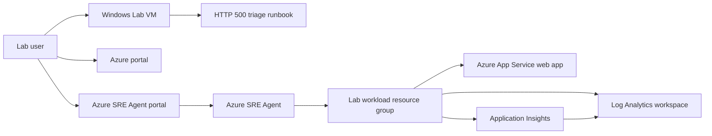

# Respond to Incidents with Azure SRE Agent
### Overall Estimated Duration: 60 Minutes

## 📘 Lab Scenario
You are acting as a site reliability engineer for a small Azure-hosted web application that has started returning intermittent HTTP 500 responses. In this lab, you will onboard Azure SRE Agent, grant it read-oriented access to a scoped lab workload, and add a team runbook so the agent can answer operational questions using your documented procedures instead of generic troubleshooting advice.

The lab is designed for a **60-minute** session. Spend the first few minutes reviewing the environment here, then complete Exercise 1 and Exercise 2.

## 📖 Lab Overview
In this lab, you will:

- Sign in to the Azure portal with your CloudLabs-provided account.
- Review a pre-created Azure App Service workload, Application Insights resource, and Log Analytics workspace.
- Open the Azure SRE Agent portal at <https://sre.azure.com>.
- Verify whether the Azure SRE Agent was created by the deployment, or create it manually in the portal if the preview ARM deployment path is unavailable in your tenant.
- Grant the agent scoped access to the lab workload resource group using the safest available read-only or review-oriented options.
- Upload the staged runbook [C:\LabFiles\Runbooks\appservice-http-500-triage.md](file:///C:/LabFiles/Runbooks/appservice-http-500-triage.md) to the agent knowledge base in Exercise 2.

## 🎯 Objectives
After completing this lab, you will be able to:

- Describe the Azure resources that make up the sample incident environment.
- Explain the preview status and supported-region requirements for Azure SRE Agent.
- Create or verify an Azure SRE Agent in the Azure SRE Agent portal.
- Configure the agent to inspect a workload resource group with least-privilege access.
- Add Markdown runbook knowledge to Azure SRE Agent and verify that responses cite or reference the uploaded guidance.

## ⚙️ Prerequisites
- Familiarity with the Azure portal and basic role-based access control (RBAC) concepts.
- Basic understanding of Application Insights, Log Analytics, and KQL.
- Familiarity with incident triage or on-call runbook concepts.
- An active Microsoft Azure subscription to provision and access required resources.
- A pre-provisioned Microsoft Entra ID user account with sufficient permissions to create and manage resources within the Azure subscription.

## 🏗️ Architecture
CloudLabs deploys a disposable lab environment that contains a Windows Lab VM, a small App Service workload, monitoring resources, and a staged operations runbook. The deployment also attempts to create an Azure SRE Agent resource when the preview API is available in the target tenant. If that preview resource cannot be deployed automatically, the exercises walk you through the documented portal fallback.

## 🖼️ Architecture Diagram

## 🔍 Explanation of Components
**Windows Lab VM**: Provides browser access, tools, helper files, and the staged runbook used throughout the lab.

**Azure App Service web app**: Represents the application that is returning intermittent HTTP 500 responses. It is the workload the SRE Agent investigates.

**Application Insights**: Collects application telemetry for requests, failures, dependencies, and diagnostics, and is one of the two supported telemetry connectors for Azure SRE Agent.

**Log Analytics workspace**: Stores queryable operational data used by Application Insights and Azure Monitor, and can be connected to the agent as a KQL-queryable log source.

**Runbook file**: Provides team-specific incident guidance for App Service HTTP 500 triage. The staged file is [C:\LabFiles\Runbooks\appservice-http-500-triage.md](file:///C:/LabFiles/Runbooks/appservice-http-500-triage.md). You upload this file to the agent's Knowledge base in Exercise 2 so that chat responses can be grounded in team-specific guidance.

**Azure SRE Agent**: Provides the agent experience for resource inspection, operational chat, and knowledge-grounded incident response. It may be pre-created by the deployment or created manually in Exercise 1.

## 🚀 Getting Started with the Lab
Welcome to your Respond to Incidents with Azure SRE Agent lab! We've prepared a seamless environment for you to explore and learn about Azure services. Let's begin by making the most of this experience:

### Accessing Your Lab Environment
Once you are ready to dive in, your virtual machine and this guide will be right at your fingertips within your web browser.

### Lab Guide Zoom In/Zoom Out
To adjust the zoom level for the environment page, click the **A↕: 100%** icon located next to the timer in the lab environment.

### Manage Your Virtual Machine
Your virtual machine is your workhorse throughout the lab. The lab guide is your roadmap to success.

### Exploring Your Lab Resources
To get a better understanding of your lab resources and credentials, navigate to the **Environment** tab.

### Utilizing the Split Window Feature
For convenience, you can open the lab guide in a separate window by selecting the **Split Window** button from the top right corner.

### Managing Your Virtual Machine
Feel free to start, stop, or restart your virtual machine as needed from the **Resources** tab. Your experience is in your hands!

### Validating Your Lab Tasks
Once you complete a task, you will see a **Validate** button integrated within the lab guide where a checkpoint applies. Click this button to ensure the lab instructions have been followed correctly and the tasks have been completed successfully.

- If the validation is successful, a **Success** status is displayed, and you can proceed to the next task.
- If the validation fails, select **See why?** to view details about what went wrong, address the issue, then select **Retry Validation**.
- If you continue to face issues, carefully review the steps in the lab guide before attempting validation again.

## ☁️ Let's Get Started with Azure Portal
1. Open a browser on the Lab VM.
2. Go to <https://portal.azure.com>.
3. You will see the **Sign in to Microsoft Azure** tab. Enter your credentials:

   - Username: <inject key="AzureAdUserEmail"></inject>
   - Password: <inject key="AzureAdUserPassword"></inject>

4. If prompted to stay signed in, select **Yes**.
5. If a **Welcome to Microsoft Azure** pop-up window appears, select **Cancel** to skip the tour.
6. Confirm that you are working in subscription <inject key="SubscriptionID"></inject> and tenant <inject key="TenantID"></inject>.
7. Your lab deployment identifier is **Lab deployment <inject key="DeploymentID" enableCopy="false"/>**. Use this value to recognize lab-created resource names when they include the deployment suffix.

## 🆘 Support Contact
The CloudLabs support team is available 24/7, 365 days a year, via email and live chat to ensure seamless assistance anytime. We offer dedicated support channels tailored specifically for learners and instructors, ensuring that all your needs are promptly and efficiently addressed.

Learner Support Contacts:

- Email Support: cloudlabs-support@spektrasystems.com
- Live Chat Support: <https://cloudlabs.ai/labs-support>

Click **Next** from the lower right corner to move on to the next page.

### Happy Learning!!